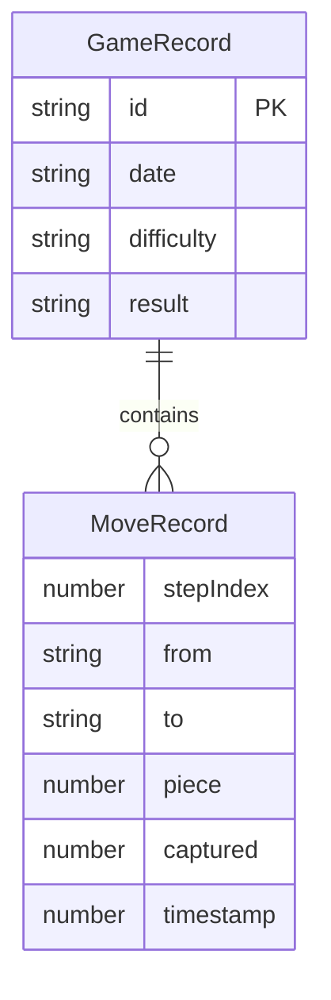

## 1. 架构设计

```mermaid
flowchart TB
    subgraph "前端层"
        "Vue3 + Vite + TypeScript"
        "Vue Router"
        "Pinia 状态管理"
        "LeaferJS 棋盘渲染"
    end
    subgraph "核心逻辑层"
        "象棋规则引擎"
        "AI对弈引擎"
        "棋局记录管理"
    end
    subgraph "数据持久层"
        "LocalStorage"
    end
    "前端层" --> "核心逻辑层"
    "核心逻辑层" --> "数据持久层"
```

## 2. 技术说明

- **前端框架**：Vue3 + TypeScript + Vite
- **UI样式**：Tailwind CSS
- **棋盘渲染**：LeaferJS（2D图形渲染引擎）
- **状态管理**：Pinia
- **路由**：Vue Router
- **数据持久化**：LocalStorage（存储历史对局记录）
- **无后端**：纯前端应用，AI逻辑在前端运行

## 3. 路由定义

| 路由 | 用途 |
|------|------|
| `/` | 主页，显示开始对局和历史对局入口 |
| `/game` | 对局页面，人机对弈 |
| `/history` | 历史对局页面，对局列表与复盘分析 |

## 4. 核心模块设计

### 4.1 象棋规则引擎 (`src/utils/chess-engine.ts`)

- 棋盘数据结构：10行9列二维数组
- 棋子编码：正数为红方，负数为黑方（1帅/2仕/3相/4马/5车/6炮/7兵）
- 核心方法：
  - `getValidMoves(board, pos)` - 获取某位置棋子的所有合法走法
  - `isValidMove(board, from, to)` - 验证走法是否合法
  - `isInCheck(board, side)` - 判断是否被将军
  - `isCheckmate(board, side)` - 判断是否被将死
  - `makeMove(board, from, to)` - 执行走子并返回新棋盘

### 4.2 AI对弈引擎 (`src/utils/chess-ai.ts`)

- 基于Minimax算法 + Alpha-Beta剪枝
- 难度区分：
  - 简单：搜索深度2，简单评估函数
  - 中等：搜索深度3，改进评估函数
  - 困难：搜索深度4，完整评估函数 + 走法排序
- 评估函数：子力价值 + 位置价值 + 机动性
- 子力价值：帅=10000, 车=900, 马=400, 炮=450, 仕=200, 相=200, 兵=100(过河200)

### 4.3 棋局记录管理 (`src/utils/game-record.ts`)

- 记录每步走法：`{ from, to, piece, captured, timestamp }`
- 保存/读取对局：LocalStorage序列化
- 对局元信息：`{ id, date, difficulty, result, moves[] }`

### 4.4 LeaferJS棋盘渲染 (`src/composables/useChessBoard.ts`)

- 绘制棋盘：线条、楚河汉界、九宫斜线
- 绘制棋子：圆形 + 文字，红黑区分
- 交互处理：点击选中、点击走子、合法位置提示
- 动画效果：选中光圈、走子动画

## 5. 数据模型

### 5.1 数据模型定义



### 5.2 棋盘数据结构

```typescript
type PieceType = 1 | 2 | 3 | 4 | 5 | 6 | 7
type Side = 'red' | 'black'
type Position = { row: number; col: number }
type BoardState = number[][]

interface ChessPiece {
    type: PieceType
    side: Side
    position: Position
}

interface MoveResult {
    board: BoardState
    captured: number
    isValid: boolean
}

interface GameRecord {
    id: string
    date: string
    difficulty: 'easy' | 'medium' | 'hard'
    result: 'red_win' | 'black_win' | 'draw'
    moves: MoveRecord[]
    initialBoard: BoardState
}

interface MoveRecord {
    stepIndex: number
    from: Position
    to: Position
    piece: number
    captured: number
    timestamp: number
}
```

## 6. 项目目录结构

```
src/
├── components/
│   ├── ChessBoard.vue          # LeaferJS棋盘组件
│   ├── DifficultyModal.vue     # 难度选择弹窗
│   ├── GameMenu.vue            # 对局菜单栏
│   ├── GameResultModal.vue     # 对局结果弹窗
│   ├── ReplayControls.vue      # 复盘控制栏
│   └── GameList.vue            # 历史对局列表
├── composables/
│   ├── useChessBoard.ts        # LeaferJS棋盘渲染与交互
│   └── useChessGame.ts         # 对局逻辑管理
├── pages/
│   ├── HomePage.vue            # 主页
│   ├── GamePage.vue            # 对局页面
│   └── HistoryPage.vue         # 历史对局/复盘页面
├── stores/
│   └── gameStore.ts            # Pinia全局状态
├── utils/
│   ├── chess-engine.ts         # 象棋规则引擎
│   ├── chess-ai.ts             # AI对弈引擎
│   └── game-record.ts          # 棋局记录管理
├── router/
│   └── index.ts                # 路由配置
├── App.vue
└── main.ts
```
